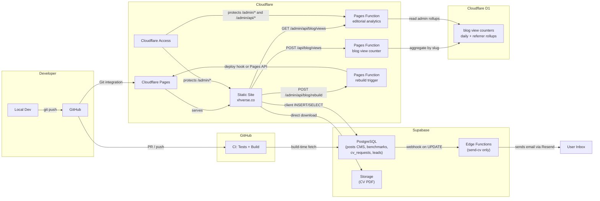

# XHVerse Site

[](https://github.com/devruji/xhverse-site/actions/workflows/ci.yml)
[](https://astro.build)
[](https://bun.sh/)
[](https://opensource.org/licenses/MIT)

Personal portfolio, blog, and interactive tools site for [Rujikorn Ngoensaard](https://xhverse.co) (XH / bossruji) — Data Architect specializing in Azure, Databricks, Microsoft Fabric, and data governance.

## Tech Stack

- **Framework:** [Astro 6](https://astro.build/) (static output)
- **Styling:** [Tailwind CSS v4](https://tailwindcss.com/) via Vite plugin
- **Runtime:** [Bun](https://bun.sh/) + Node 22.16.0
- **Testing:** [Vitest](https://vitest.dev/) (100% coverage) & [Playwright](https://playwright.dev/) (E2E)
- **Database:** [Supabase](https://supabase.com/) (blog CMS/source of truth, client-side benchmarks, CV gate)
- **Blog Analytics:** Cloudflare Pages Functions + D1 for anonymous aggregate blog views
- **Edge Functions:** Supabase Edge Functions (Deno) for CV email delivery
- **Deployment:** [Cloudflare Pages](https://pages.cloudflare.com/) (Git integration)
- **Admin:** Protected by [Cloudflare Access](https://www.cloudflare.com/products/zero-trust/) (Zero Trust, email OTP)

## Architecture



See [docs/architecture.md](docs/architecture.md) for detailed data flow, security model, and page inventory.
For the blog view-count runtime, see [docs/blog-analytics.md](docs/blog-analytics.md).

## Features

- **Portfolio & Blog** — Static portfolio content plus Supabase-authored blog posts published as static HTML with anonymous aggregate view counts
- **Interactive Tools** — Data Platform Maturity Checker, Governance Readiness Scorecard
- **Advisory Services** — Engagement types, process flow, conversion path
- **CV Gate** — Email capture modal → admin approval → automated PDF delivery via Edge Function
- **Admin Panel** — Dashboard, CV request management, lead tracking, tool submissions, blog analytics
- **Dark/Light Theme** — CSS variable system with anti-FOUC, zero-JS theme swap
- **100% Test Coverage** — Unit tests on all data/logic modules, E2E on all pages

## Getting Started

### Prerequisites

- [Bun](https://bun.sh/) (v1.2+)
- [Node.js](https://nodejs.org/) 22.16.0 (pinned in `.node-version`)

### Installation

```sh
git clone https://github.com/devruji/xhverse-site.git
cd xhverse-site
bun install
```

### Local Development

```sh
bun run dev          # http://localhost:4321
```

### Testing

```sh
bun run typecheck    # Astro type/content checks
bun run coverage     # Unit tests + 100% coverage enforcement
bun run test:e2e     # Playwright (chromium desktop + mobile)
bun run check        # Full pipeline: typecheck + build + coverage + e2e
```

### Building for Production

```sh
bun run build        # Output → ./dist/
```

### Edge Runtime

```sh
bunx supabase functions deploy send-cv    # Deploy CV email function
bunx supabase secrets set RESEND_API_KEY=re_xxxxx
```

- **Cloudflare Pages Functions:** `/api/blog/views` and `/admin/api/blog/views`
- **Cloudflare D1 binding:** `BLOG_ANALYTICS_DB` for anonymous aggregate blog views
- **Cloudflare rebuild trigger:** deploy hook or Pages API env vars for admin-triggered static blog republishing
- **Supabase Edge Functions:** `send-cv` for approved CV email delivery

### Blog Analytics Roadmap

| Phase | Scope | Status |
|-------|-------|--------|
| v1 | Public anonymous aggregate page views by blog slug | Code path added; Cloudflare D1 binding configured |
| v2 | Admin/editorial rollups by post, date, and referrer bucket | Code path added under `/admin/blog/analytics/`; Cloudflare D1 binding configured |
| v3 | Unique visitor counting or de-duplication | Deferred; no fingerprinting or identity tracking |

## Deployment

Cloudflare Pages Git integration handles all deployments:

| Branch | Environment | URL |
|--------|-------------|-----|
| `main` | Production | https://xhverse.co |
| `development` | Preview | Auto-generated preview URL |
| `feat/*` | Preview | Auto-generated preview URL |

Cloudflare Pages settings:
- **Build command:** `bun run build`
- **Output directory:** `dist`
- **Node version:** Read from `.node-version`

### Environment Variables

| Variable | Environment | Purpose |
|----------|-------------|---------|
| `SUPABASE_URL` | Build | Database URL |
| `PUBLIC_SUPABASE_PUBLISHABLE_KEY` | Build + client | Public read key for published blog rows and browser Supabase clients |
| `SUPABASE_SECRET_KEY` | Build (secret, optional legacy) | Server read key fallback for published blog rows |
| `PUBLIC_SUPABASE_URL` | Build + client | For CSP connect-src |
| `PUBLIC_SITE_URL` | Production | Canonical URL override |
| `PUBLIC_ALLOW_INDEXING` | Preview (optional) | Force indexing on preview |
| `BLOG_VIEW_TRACKING` | Pages Functions (optional) | Set `disabled` to read counts without incrementing |
| `BLOG_REBUILD_HOOK_URL` | Pages Functions (secret, optional) | Cloudflare deploy hook called after admin blog mutations |
| `CLOUDFLARE_API_TOKEN` | Pages Functions (secret) | Cloudflare API token with Pages deployment edit/create access for admin rebuilds when no deploy hook is configured |
| `CLOUDFLARE_ACCOUNT_ID` | Pages Functions | Cloudflare account ID used by the admin rebuild API trigger |
| `CLOUDFLARE_PAGES_PROJECT_NAME` | Pages Functions | Pages project name, currently `xhverse-site-git` |
| `CLOUDFLARE_PAGES_REBUILD_BRANCH` | Pages Functions (optional) | Branch to rebuild after admin mutations; defaults to `main` |

Cloudflare D1 is configured in both preview and production Pages environments as a binding named `BLOG_ANALYTICS_DB`; it is not a client-exposed environment variable.
Use `wrangler.example.toml` for the expected binding shape. Do not commit a real
`wrangler.toml` until the current Cloudflare Pages dashboard configuration has
been downloaded and reconciled.

Blog authoring uses Supabase as the source of truth. The admin Blog Writer saves
drafts/published posts to Supabase; public blog pages stay static and update
after Cloudflare Pages rebuilds from the configured deploy hook or Pages API
trigger. `src/data/blog.ts` is retained only as local fallback/seed content when
Supabase build credentials are absent.

To migrate current fallback posts into Supabase, run the seed script with service
role build credentials after the schema migration is applied:

```sh
bun run scripts/seed-blog-posts-to-supabase.ts --dry-run
bun run scripts/seed-blog-posts-to-supabase.ts
```

### Branch Flow

```
feat/* ──PR──→ development ──Release PR──→ main ──tag──→ GitHub Release
```

Both `development` and `main` are protected branches requiring PRs + passing CI.

## © License & Copyright

This project's code is licensed under the [MIT License](./LICENSE).

**Note:** Unless otherwise stated, all written content, images, and personal media published on the site are **all rights reserved** to the author.
