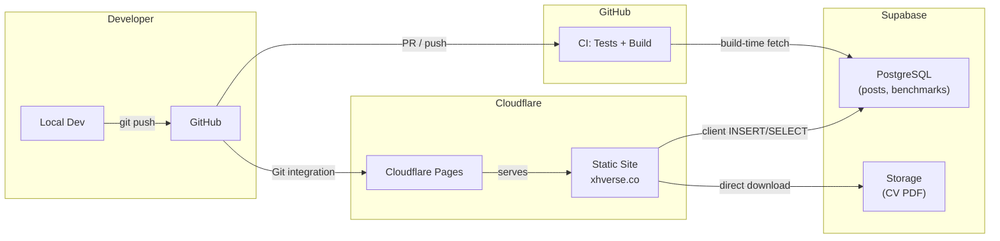

# Architecture

## System Overview

## Data Flow

### Build Time (Astro Static Generation)

1. CI or Cloudflare Pages runs `bun run build`
2. `scripts/generate-headers.ts` writes `public/_headers` with CSP derived from `PUBLIC_SUPABASE_URL`
3. Astro fetches published blog posts from Supabase (`SUPABASE_URL` + `SUPABASE_SECRET_KEY`)
4. Falls back to `src/data/blog.ts` if credentials are missing or query fails
5. Generates static HTML for all pages → `dist/`

### Client Side (Browser)

- **Maturity tool**: Browser submits assessment results (INSERT) and reads aggregate benchmarks (SELECT) via Supabase anon key
- **CV page**: Links directly to Supabase Storage public URL for PDF download
- **CSP**: Both `_headers` (Cloudflare edge) and `<meta>` (BaseLayout) restrict `connect-src` to the Supabase project origin

### Deployment

- **Production**: push to `main` → Cloudflare Pages builds and deploys to `xhverse.co`
- **Preview**: push to `development` or `feat/*` → preview URL with auto `noindex`
- **CI**: GitHub Actions runs typecheck, build, coverage (100%), and E2E on every push/PR

## Security Model

| Layer | Mechanism |
|-------|-----------|
| Edge headers | `public/_headers` → CSP, HSTS, X-Frame-Options (generated at build) |
| HTML meta | `BaseLayout.astro` → CSP `connect-src` from env (production only) |
| Database | RLS on all tables; anon: insert-only on submissions, select-only on benchmarks |
| Storage | Public read on `documents` bucket; no write access via client |
| Build secrets | `SUPABASE_SECRET_KEY` server-only, never in client bundles |
