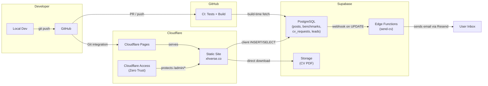

# Architecture

## System Overview



## Data Flow

### Build Time (Astro Static Generation)

1. CI or Cloudflare Pages runs `bun run build`
2. `scripts/generate-headers.ts` writes `public/_headers` with CSP derived from `PUBLIC_SUPABASE_URL`
3. Astro fetches published blog posts from Supabase (`SUPABASE_URL` + `SUPABASE_SECRET_KEY`)
4. Falls back to `src/data/blog.ts` if credentials are missing or query fails
5. Generates static HTML for all pages → `dist/`

### Client Side (Browser)

- **Maturity Checker**: Submits assessment results (INSERT) and reads aggregate benchmarks (SELECT) via Supabase anon key
- **Governance Scorecard**: Client-side scoring only — no Supabase persistence yet
- **CV Gate**: User submits email via modal → INSERT to `cv_download_requests` (status: pending)
- **Admin Panel**: Reads/updates cv_requests, leads, maturity submissions via Supabase anon key + RLS
- **CSP**: Both `_headers` (Cloudflare edge) and `<meta>` (BaseLayout) restrict `connect-src` to the Supabase project origin

### CV Delivery Flow

```
User clicks "Get a Copy" → CvRequestModal opens
    → User submits email → INSERT cv_download_requests (status: pending)
    → Admin approves at /admin/cv-requests → UPDATE status = approved
    → Supabase webhook fires → send-cv Edge Function triggered
    → Edge Function sends email with PDF link via Resend API
    → UPDATE status = sent, sent_at = now()
```

### Deployment

- **Production**: push to `main` → Cloudflare Pages builds and deploys to `xhverse.co`
- **Preview**: push to `development` or `feat/*` → preview URL with auto `noindex`
- **CI**: GitHub Actions runs typecheck, build, coverage (100%), and E2E on every push/PR
- **Edge Functions**: deployed separately via `bunx supabase functions deploy send-cv`

## Security Model

| Layer | Mechanism |
|-------|-----------|
| Edge headers | `public/_headers` → CSP, HSTS, X-Frame-Options, CORP (generated at build) |
| HTML meta | `BaseLayout.astro` → CSP `connect-src` from env (production only) |
| Admin access | Cloudflare Access (Zero Trust) → email OTP for `/admin/*` routes |
| Database | RLS on all tables; anon: insert-only on submissions, select-only on reads |
| Storage | Public read on `documents` bucket; no write access via client |
| Build secrets | `SUPABASE_SECRET_KEY` server-only, never in client bundles |
| Edge Function secrets | `RESEND_API_KEY` set via `bunx supabase secrets set` |

## Pages

| Route | Purpose | Data Source |
|-------|---------|-------------|
| `/` | Homepage — profile, work themes, tools, contact | `src/data/profile.ts`, `src/data/site.ts` |
| `/about` | Extended bio | Static |
| `/blog` | Architecture notes | Supabase `posts` table (build-time) |
| `/cv` | Resume with PDF view + gated download | Supabase Storage + `cv_download_requests` |
| `/gallery` | Visual work samples | `src/data/gallery.ts` |
| `/services` | Advisory engagement types, process, fit signals | `src/data/services.ts` |
| `/tools` | Tool index page | Static |
| `/tools/data-platform-maturity-checker` | 15-question maturity assessment | Client-side + Supabase benchmarks |
| `/tools/governance-scorecard` | 20-question governance readiness | Client-side only |
| `/admin` | Dashboard (protected) | Supabase (client-side) |
| `/admin/cv-requests` | CV request management | `cv_download_requests` table |
| `/admin/leads` | Lead tracking | `leads` table |
| `/admin/tools/maturity` | Maturity submissions | `maturity_submissions` table |

## Database Tables

| Table | Purpose | RLS |
|-------|---------|-----|
| `posts` | Blog posts (fetched at build time) | select: anon; insert/update: service_role |
| `maturity_submissions` | Anonymous tool submissions | insert: anon; select: anon (aggregate view) |
| `cv_download_requests` | CV gate email submissions | insert: anon; select/update: service_role + admin |
| `leads` | Contact/engagement leads | insert: anon; select: service_role + admin |

## Edge Functions

| Function | Trigger | Purpose |
|----------|---------|---------|
| `send-cv` | Webhook on `cv_download_requests` UPDATE (status → approved) | Sends CV PDF link via Resend email |
